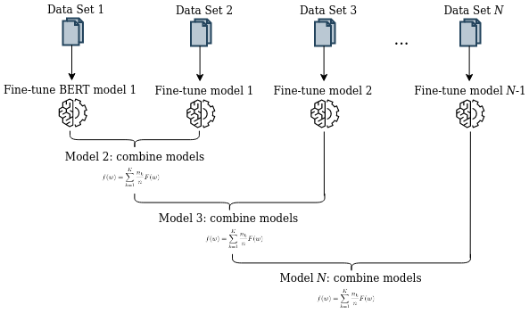

# BERT WEAVER - using WEight AVERaging to enable lifelong learning for transformer-based models

Recent developments in transfer learning have boosted the advancements in natural language processing tasks. The performance is, however, dependent on high-quality, manually annotated training data. Especially in the biomedical domain, it has been shown that one training corpus is not enough to learn generic models that are able to efficiently predict on new data. Therefore, state-of-the-art models need the ability of lifelong learning in order to improve performance as soon as new data are available - without the need of retraining the whole model from scratch. We present WEAVER, a simple, yet efficient post-processing method that infuses old knowledge into the new model, thereby reducing catastrophic forgetting. We show that applying WEAVER in a sequential manner results in similar word embedding distributions as doing a combined training on all data at once, while being computationally more efficient. Because there is no need of data sharing, the presented method is also easily applicable to federated learning settings and can for example be beneficial for the mining of electronic health records from different clinics.  

## About this repo
This repo contains the code for a simple post processing method that averages the weights of two models that have been
trained on top of each other. For example, model *A* has been trained on data *A*, afterwards model *A* has been
re-trained on data *B*. The weights of these two models are then averaged based on the amount of training data they were
trained on. This can be done in a continuous manner and shows promising results. This can also be applied for more than
two models using the argument `--further_models`. However, based on our experiments, we suggest to always train one
model on top of another and then merge these two models, as indicated in the Figure below. 

## How to use
Clone the repository to your local folder: `git clone https://github.com/llangnickel/WEAVER.git`   
and then change the directory: `cd WEAVER`  
  
Create a virtual environment: `python -m venv venv`  
And activate it: `source venv/bin/activate`  
Install the required dependencies: `pip install -r requirements.txt`  
  
Apply WEAVER to two or more already trained models, for example:  
`python weaver.py --output_dir output --baseline_model bert-base-cased --amount_of_labels 3 --first_model_path path_to_trained_model_1 --second_model_path path_to_trained_model_2 --amount_first_model 500 --amount_second_model 500`
  
For help, use: `python weaver.py -h`

## How to Cite
@misc{langnickel2022bert,  
      title={BERT WEAVER: Using WEight AVERaging to Enable Lifelong Learning for Transformer-based Models},   
      author={Lisa Langnickel and Alexander Schulz and Barbara Hammer and Juliane Fluck},  
      year={2022},  
      eprint={2202.10101},  
      archivePrefix={arXiv},  
      primaryClass={cs.CL}  
}  

